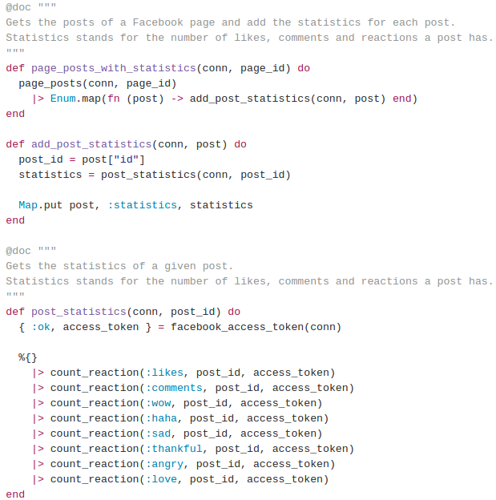
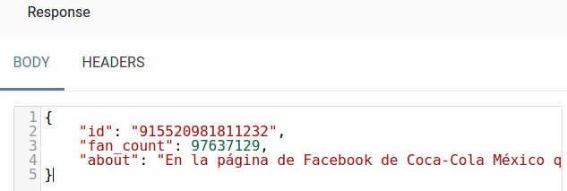
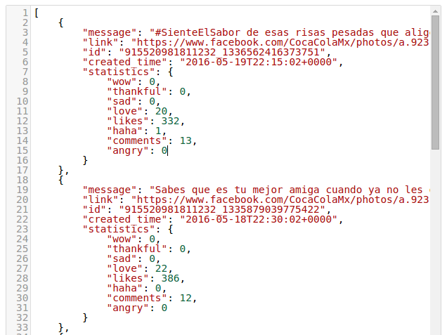

FeedRegression
==============

API escrita en [Elixir](http://elixir-lang.org) que proporciona endpoints para obtener estadísticas de los posts publicados en una página de Facebook.

Este proyecto pretende analizar el feed de una *Facebook Page*. Este análisis incluye la obtención de los posts y las métricas de los mismos, tales como el número de likes, los comentarios y las reacciones que han tenido.

## Contenido

* [Antecedentes](#antecedentes)
	* [Facebook.ex](#facebook.ex)
	* [Maru](#maru)
* [Contribución a Facebook.ex](#contribución-a-facebook.ex)
	* [pageFeed/5](#pageFeed/5)
	* [objectCount/3](#objectcount/3)
	* [objectCount/4](#objectcount/)
* [La API](#la-api)
	* [Estructura del proyecto](#estructura-del-proyecto)
	* [Endpoints](#endpoints)
	* [Obtención de los posts con métricas](#obtención-de-los-posts-con-métricas)
	* [Rate limiting](#rate-limiting)
* [Resultados](#resultados)
	* [Información de la página](#información-de-la-página)
	* [Posts con métricas](#posts-con-métricas)
* [Conclusiones](#conclusiones)

## Antecedentes

La [Graph API](https://developers.facebook.com/docs/graph-api) es un servicio de Facebook con el que se puede obtener detalles de una página como los likes, su descripción, los comentarios que ha tenido un post, los permisos de una aplicación, ubicación de los usuarios, etc.

Facebook proporciona algunos SDK para ciertos lenguajes de programación como Java, PHP, JavaScript, entre otros. Sin embargo, **se estimó que la API se escribiera en Elixir** debido a la facilidad que brinda su capacidad de crear de peticiones concurrentes, esto es, poder solicitar las métricas de los posts en paralelo, reduciendo así el tiempo de obtención de la información.

### Facebook.ex

En la búsqueda de librerías en Elixir con las que se pudiera acceder a la Graph API, se encontró la [facebook.ex](https://github.com/mweibel/facebook.ex), un *software opensource* que proporciona funciones para consumir información de Facebook.

Esta librería contenía funciones bastante útiles para los fines de este proyecto, como la obtención del número de likes de una página y su descripción. Sin embargo, faltaban algunas otras, por lo que se optó por contribuir a dicha librería con la intención de que estuviera más completa y pudiera brindarnos la información que el proyecto requería.

### Maru

[Maru](https://github.com/falood/maru) es un *micro-framework* que permite la escritura de REST APIs utilizando el lenguaje de programación Elixir.

Se eligió Maru por ser muy ligero y tener pocas dependencias, además la intregración de otras librerías con este framework resulta ser una labor sencilla.

## Contribución a Facebook.ex

La codificación de este proyecto tuvo aporte al OpenSource debido a la contribución que se realizó a la librería [facebook.ex](https://github.com/mweibel/facebook.ex), donde se escribieron funciones de suma importancia.

### pageFeed/5

[Documentación](https://hexdocs.pm/facebook/Facebook.html#pageFeed/5).
Obtiene el feed de la *Facebook Page*, considerando que existen cuatro tipos de feed:
* **feed**. Compuesto por los posts publicados por la misma página, publicaciones de otros usuarios sobre la página y posts en los que fue mencionada la página.
* **posts**. Limitado a los posts que escribió la página.
* **tagged**. Limitado a los posts en los que fue mencionada la página.
* **promotable**. Constituido por los posts que pueden ser promovidos (*sponsored*) por el administrador de la página.

 

 

### objectCount/3

[Documentación](https://hexdocs.pm/facebook/Facebook.html#objectCount/3).
Proporciona el número de likes o comentarios que tiene un post.

 

 

### objectCount/4

[Documentación](https://hexdocs.pm/facebook/Facebook.html#objectCount/4).
Proporciona el número de las personas que reaccionaron al post. Para ello se debe especificar el tipo de reacción que se desea calcular: haha, love, angry, thankful, sad, none y wow.

 

 

## La API

### Estructura del proyecto

*Mix* es la herramienta de construcción para el lenguaje de programación Elixir. Después de diseñar la API y al hacer uso de mix, se obtiene la siguiente estructura de archivos:

    ├── config
    │   └── config.exs
    ├── deps
    │   ├── cowboy
    │   ├── facebook
    │   ├── hackney
    │   ├── json
    │   ├── maru
    ├── lib
    │   ├── controllers
    │   │   └── pages_controller.ex
    │   ├── feed_regression.ex
    │   └── router
    │       └── page_router.ex
    ├── mix.exs
    ├── README.md
    └── test
         └── test_helper.exs

Donde:
* **config.exs** es el archivo de configuración donde se porporciona información del host y puerto para el servidor de aplicación.
* **mix.exs** es donde se define la descripción del proyecto, así como sus dependencias.
* **deps** es la carpeta donde se almacenan las dependencias una vez descargadas.
* **lib** contiene el código fuente de la api, por lo que aquí se podrán encontrar los endpoints y controladores.
* **test** es donde se ubican los archivos de pruebas unitarias y de integración.

### Endpoints

* **/pages/{page-id}**. Obtienes la información de la página.
* **/pages/{page-id}/posts**. Proporciona el feed (con el tipo posts) de la página junto con las métricas del número de likes, comentarios y reacciones.

### Obtención de los posts con métricas

Para la obtención de los posts de una página, se declaró a *facebook.ex* como dependencia en *mix.exs*. En el archivo *pages_controller.ex* se utiliza dicha librería para la obtención del feed desde Facebook especificando el tipo *posts*. Posteriormente cada post es relacionado con sus respectivas métricas utilizando la función *objectCount/4*.

 

 

Cabe mencionar la importancia del encadenamiento de funciones *count_reaction*, donde se está obteniendo el total de cada reacción por post. Esto significa, que por cada post del feed, **se realizan ocho peticiones a la Graph API** de Facebook.

### Rate limiting

Para hacer uso de la Graph API, es necesaria la creación de una aplicación en Facebook desde su web de developers, la cual proporciona los niveles de seguridad requeridos para poder consumir información de esta API.

De acuerdo a la [documentación](https://developers.facebook.com/docs/graph-api/advanced/rate-limiting), *cada instalación* de la aplicación, **proporciona 200 llamadas por hora para consumir la API**. Esto quiere decir que una única instalación tiene un límite de 200 peticiones a la Graph API durante una hora, si se excede este límite, Facebook comienza a bloquear la petición y ninguna instalación será capaz de realizar más peticiones.

## Resultados

Esta sección describe los resultados obtenidos de la API, para ello se tomará la página de CocaCola México en Facebook para las demostraciones.

### Información de la página

Para el endpoint que obtiene información de la página, tenemos la siguiente petición:

	http://127.0.0.1:8880/pages/CocaColaMx

Obteniendo:

 

 

Se pueden notar tres atributos de esta respuesta: el id de la página, el número de personas que le ha dado like (fanCount) y el 'acerca de'. Cabe mencionar que estos campos fueron especificados programáticamente en la API, por lo que si se requiere de más información, fácilmente pueden ser definidos en el código.

### Posts con métricas

La obtención de los posts se realiza con la siguiente petición:

	http://127.0.0.1:8880/pages/CocaColaMx/posts

Obteniendo una respuesta similar a la siguiente:

 

 

Donde:

* **message**. Es el texto que acompaña al post.
* **link**. El enlace al post.
* **id**. ID de post.
* **created_time**. Su fecha de publicación.
* **statistics**. Atributo que contiene las métricas del posts, es decir, el número de likes, comentarios y reacciones que tuvo.

## Conclusiones

El consumo de la Graph API requiere de ciertas precauciones, tal como el caso de *rate limting*, para evitar el baneo de la aplicación y poder seguir consultando el feed de las páginas.

Con la información proporcionada por la API de este repositorio, se pueden aplicar diversos algoritmos de machine learning, como el *regression*, ya que al obtenerse el feed de fechas pasadas se puede analizar qué tanto *engagement* ha tenido la página con sus posts y poder observar qué momentos son los oportunos para postear y obtener las mejores métricas posibles.

