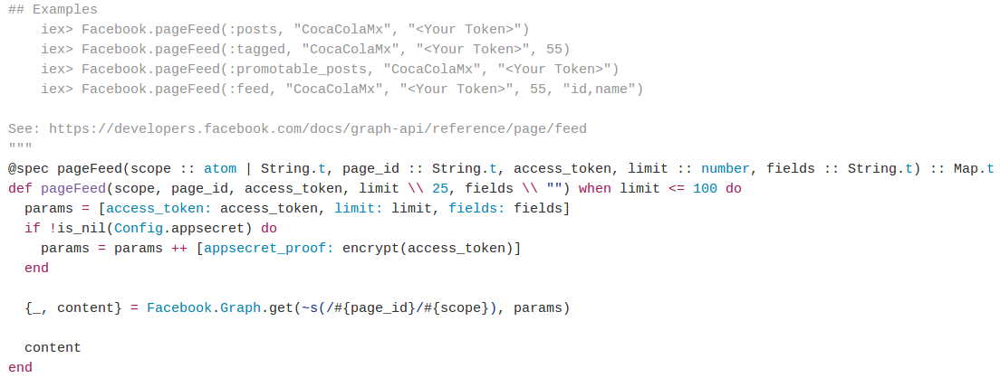
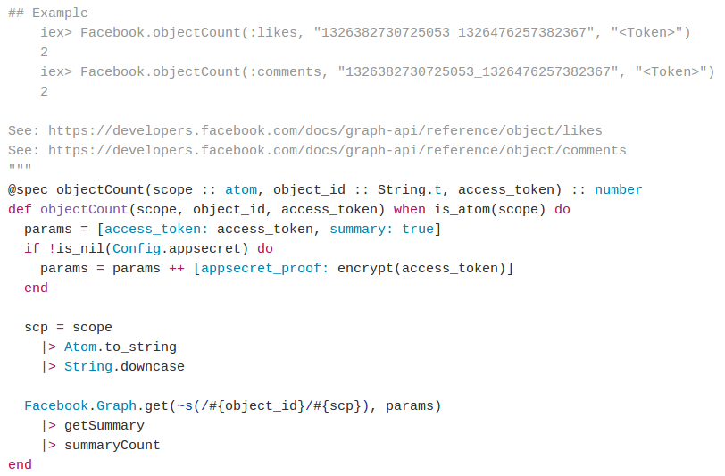
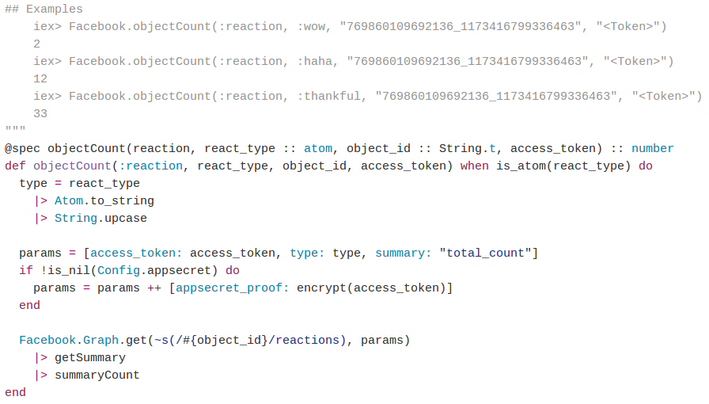

FeedRegression
==============

API escrita en [Elixir](http://elixir-lang.org) que proporciona endpoints para obtener estadísticas de los posts publicados en una página de Facebook.

Este proyecto pretende analizar el feed de una *Facebook Page*. Este análisis incluye la obtención de los posts, así como obtener las métricas de los mismos, tales como el número de likes, comentarios y reacciones que han tenido.

## Contenido

* [Antecedentes](#antecedentes)
	* [Facebook.ex](#facebook.ex)
	* [Maru](#maru)
* [Contribución a Facebook.ex](#contribución-a-facebook.ex)
	* [pageFeed/5](#pageFeed/5)
	* [objectCount/3](#objectcount/3)
	* [objectCount/4](#objectcount/)

## Antecedentes

La [Graph API](https://developers.facebook.com/docs/graph-api) es un servicio de Facebook con la que se puede obtener información de muchos ámbitos, como likes de una página así como su descripción, los comentarios que ha tenido un post, los permisos de una aplicación, ubicación de los usuarios, entre muchas otras cosas.

Facebook proporciona algunos SDK para ciertos lenguajes de programación, como Java, PHP, Javascript, entre otros. Sin embargo, durante la investigación **se estimó que la API se escribiera en Elixir**, debido a la falicidad en la creación de peticiones concurrentes, esto es, poder solicitar las métricas de los posts en paralelo, reduciendo así el tiempo de obtención de la información.

### Facebook.ex

En la búsqueda de librerías en Elixir con las que se pudiera acceder a la Graph API, se encontró la [facebook.ex](https://github.com/mweibel/facebook.ex), la cual es un *software opensource* que proporciona funciones para consumir información de Facebook.

Esta librería contenía funciones bastante útiles para los fines de este proyecto, como la obtención del número de likes de una página, así como su descripción. Sin embargo, faltaban algunas otras, por lo que se optó por contribuir a dicha librería con la intención de que estuviera más completa y pudiera brindarnos la información que el proyecto requería.

### Maru

[Maru](https://github.com/falood/maru) es un *micro-framework* que permite la escritura de REST APIs utilizando el lenguaje de programación Elixir.

Se eligió Maru por ser muy ligero y tener pocas dependencias; también la intregración de otras librerías con este framework resulta ser una labor sencilla.

## Contribución a Facebook.ex

La codificación de este proyecto tuvo aporte al OpenSource, debido a la contribución que se realizó a la librería [facebook.ex](https://github.com/mweibel/facebook.ex), donde se escribieron funciones de suma importancia para el proyecto.

### pageFeed/5

[Documentación](https://hexdocs.pm/facebook/Facebook.html#pageFeed/5).
Obtiene el feed de la *Facebook Page*, considerando que existen cuatro tipos de feed:
* **feed**. Compuesto por los posts publicados por la misma página, publicaciones de otros usuarios sobre la página y posts en los que fue mencionada la página.
* **posts**. Limitado a los posts que escribió la página.
* **tagged**. Posts en los que fue mencionada la página.
* **promotable**. Constituido por los posts que pueden ser promovidos (*sponsored*) por el administrador de la página.

### objectCount/3

[Documentación](https://hexdocs.pm/facebook/Facebook.html#objectCount/3).
Proporciona el número de likes o comentarios que tiene un post.

### objectCount/4

[Documentación](https://hexdocs.pm/facebook/Facebook.html#objectCount/4).
Proporciona el número de las personas que reaccionaron al post. Para ello se debe especificar el tipo de reacción que se desea calcular: haha, love, angry, etc.

## La API

### Estructura del proyecto

Debido al lenguaje de programación Elixir para la API, el proyecto cuenta con la siguiente estructura:

> ├── config
> │   └── config.exs
> ├── deps
> │   ├── cowboy
> │   ├── facebook
> │   ├── hackney
> │   ├── json
> │   ├── maru
> ├── lib
> │   ├── controllers
> │   │   └── pages_controller.ex
> │   ├── feed_regression.ex
> │   └── router
> │       └── page_router.ex
> ├── mix.exs
> ├── README.md
> └── test
>     └── test_helper.exs

Donde:
* config.exs es el archivo de configuración donde se porporciona información del host y puerto para el servidor de aplicación.
* mix.exs es donde se define la descripción del proyecto, así como sus dependencias.
* deps es la carpeta donde se almacenan las dependencias una vez descargadas.
* lib 

* **/pages/{page-id}**. Obtienes la información de la página.
* **/pages/{page-id}/posts**. Proporciona el feed (con el tipo posts) de la página junto con las métricas del número de likes, comentarios y reacciones.

